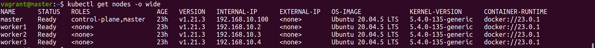
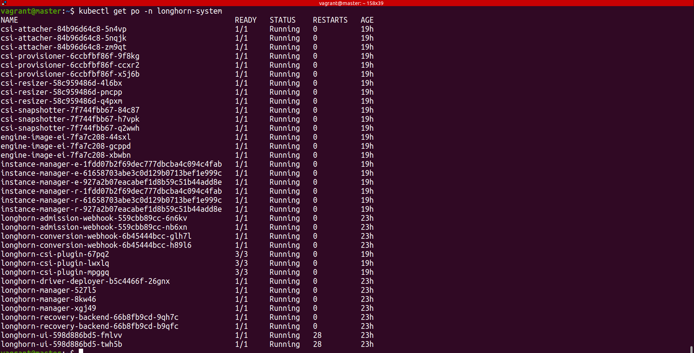
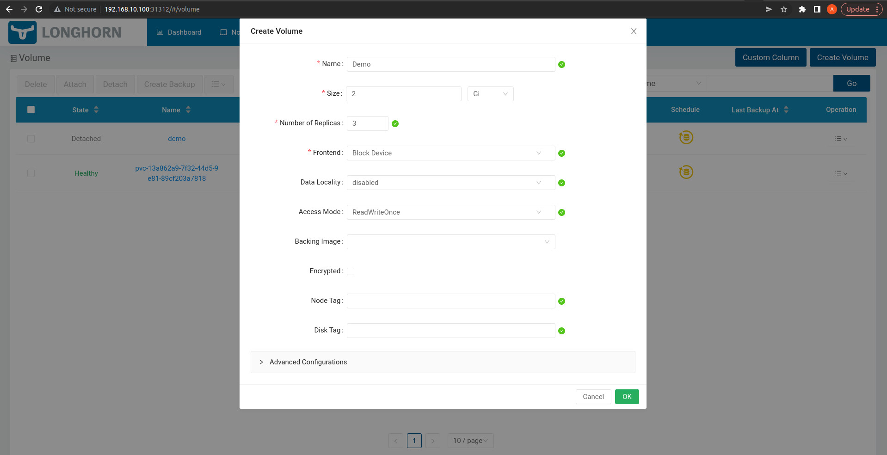
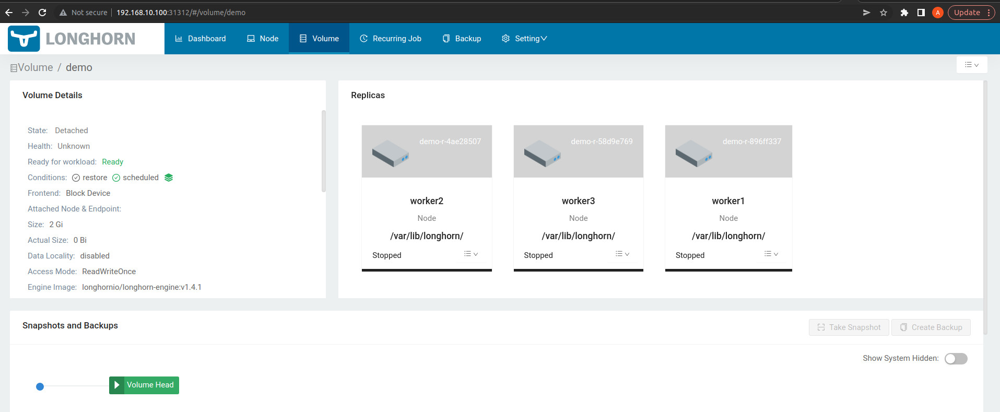
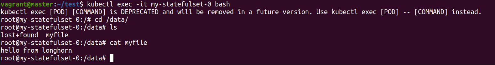

# Kubernetes cluster with a performant fault-tolerant storage system.

We will create Kubernetes Cluster locally using Virtualbox, Vagrant and Kubeadm.
And use Longhorn for Sorage solution.


## Prerequisites 

- 8Gb of RAM minimum
- 2.4GHz processor or higher
- Virtual Box - Virtualization software.
- Vagrant - Virtual machine management tool.

To install virtualbox visit the following link.

https://www.virtualbox.org/wiki/Downloads 

To install vagrant follow these steps.

```
curl -O https://releases.hashicorp.com/vagrant/2.2.9/vagrant_2.2.9_x86_64.deb
```

```
sudo apt install ./vagrant_2.2.9_x86_64.deb
```

### Setup Steps

Go to the directory where you have this files and run the command.

```
Vagrant up
```

This proccess will take a while (5 mins) to complete depending on your internet connection speed.

Here vagrant will provision 4 VM on vitrualbox. Below is overview of Vagrant up command.

1. Four VM's will be provisioned with Ubuntu-20.04 running on them. One VM will act as Kubenetes Master(control plane) and three VM's will act as an Node's
2. As soon as VM's are up `requirements.sh` this script will run on each of the VM and download, install necessary components such as Docker(Container run time for kubernetes), Kubeadm (Kubernetes Cluster), Kublet, and Kubectl to operate a cluster.
3. `master.sh` this script will run on the VM master it will Initialize the Kubernetes cluster using `kubeadm init` command. setup Cluster config file so we can use kubectl to operate the cluster.then to the flannel installation for cluster nodes and pods connectivity.install helm package manager so we can setup Longhorn on cluster using helm and in final step it will generate the token using kubeadm command so other VM's can join the cluster as node using that token.
4. `worker.sh` this script contains token to join the cluster. VM's Worker1,worker2,worker3 will join the master as a worker node using this script.


after this step you can ssh into master(control plane)vagrant using following command.

```
vagrant ssh master
```

Run the following command to see setup is working fine and all the nodes have joined the cluster.

```
kubectl get nodes -o wide
```
Your output should look like this.




After Kubernetes setup is done now we will move on to install the Longhorn on our cluster.

## Longhorn setup

As a part of VM provising we have helm installed in the master so we can install the Longhorn using that.

Steps to install Longhorn

```
vagrant ssh master
```

Add the Longhorn Helm repository:

```
helm repo add longhorn https://charts.longhorn.io
```

Fetch the latest charts from the repository:

```
helm repo update
```

Install Longhorn in the longhorn-system namespace.

```
helm install longhorn longhorn/longhorn --namespace longhorn-system --create-namespace --version 1.4.1
```

To confirm that the deployment succeeded, run:

```
kubectl -n longhorn-system get pod
```

Your output should look like this : 



After the Longhorn is  installed we have to access the UI and Create storage.
To access the UI we will expose the `Longhorn frontend` to do that we will expose that service as NodePort.

```
Kubectl edit svc longhorn-frontend -n longhorn-system
```
Now change the type from `ClusterIp` to `NodePort` 

Now we should be able to Access the UI using master's IP and the port which is now allocated to the service for example : `http://192.168.10.100:31312/`


## Create Fault tolerant storage using Longhorn

Now we have access to the UI we will create storage which will be highly available. that means storage will  be replicated on all of our worker nodes so if any of the pod fails kubernetes will attach the newly created pod with the storage which is available on all the nodes.
If any of the nodes fails then kubernetes will schedule a pod on another node and attach the volume to the pod.
For that we will use StatefulSets and persistent volume.


Now we will access the UI and create the volume with 3 replicas so all 3 worker node will have the copies.



After creating the volume we can see it in the cluster as well.

```
kubect get volume -A
```

And in the UI you should be able to see worker's with replicas : 



Now we have volume with storageclass `longhorn`.
we can claim it using PersistentVolumeClaim.
you can use this code and create yaml file and deploy it in the cluster.

```
apiVersion: v1
kind: PersistentVolumeClaim
metadata:
  name: nginx-volume
spec:
  accessModes:
    - ReadWriteOnce
  volumeMode: Filesystem
  resources:
    requests:
      storage: 1Gi

```
we should have the PersistentVolume available with storageclass longhorn.
we can attach this PersistentVolume to any pod we wish.


## Tests

We have volume in place  with replica's across all the nodes. We will test  different scenarios to make sure data loss is not occurring if the pod or node fails.

1. Deploy a stateful-set.
```
apiVersion: apps/v1
kind: StatefulSet
metadata:
  name: my-statefulset
spec:
  replicas: 1
  selector:
    matchLabels:
      app: nginx
  serviceName: nginx
  template:
    metadata:
      labels:
        app: nginx
    spec:
      containers:
      - name: my-container
        image: nginx
        ports:
        - containerPort: 80
        resources:
          limits:
            cpu: "500m"
            memory: "1Gi"
        volumeMounts:
        - name: nginx-volume
          mountPath: "/data"
      volumes:
      - name: nginx-volume
        persistentVolumeClaim:
          claimName: nginx-volume
```
This statefulset will create Nginx pod and mount the volume which we have created earlier in to the pod.

we will create an file in the pod data. so whenever pod goes down or fails kubernetes will create new pod and attach this volume to the pod and we will not see any data loss.

```
kubectl exec -it my-statefulset-0 bash
cd /data
echo "Hello from Longhorn" > myfile
```

`Test 1` : Delete the pod started by stateful set. 

a. Kubernetes would reschedule a pod, the original/copy volume should be
attached to the new pod, There should be no data loss.

To perform the above test we will delete the pod and check if the newly created pod is having the file which we created earlier in the pods data directory.

```
kubectl delete po my-statefulset-0
```

After this command there should be new pod running and we can check its data directory.

```
kubectl exec -it my-statefulset-0 bash
cd /data
```



`Test 2`: Cordon/Turn off the VM on which volume is stored for the stateful set

a. Kubernetes should be able to attach to the backup volume

In this case volume will be attached to the pod because replicas are available on all the nodes.

`Test 3`: Cordon/Turn off the VM on which pod for the stateful set is deployed

a. Kubernetes should be able to schedule another pod which attaches the same or the copy volume

We can cordon the node using below command 

```
kubectl cordon worker1
```

we should be able to see no data loss. we can check that by going into newly created pod.

`Test 4`: Force test 2 and 3 together

a. New pod on new node should be scheduled with the copy volume attached.

To test we run following commands.
```
kubectl cordon worker1
```

```
kubectl delete my-statefulset-0 
```

Now kubernetes will not schedule any pod in node(worker1).
Next we will delete the pod from the node so kubernetes will schedule the pod on another node and we should see that the new pod is having no data loss by going into the data directory of the pod and see the file(myfile) which we created earliar.

